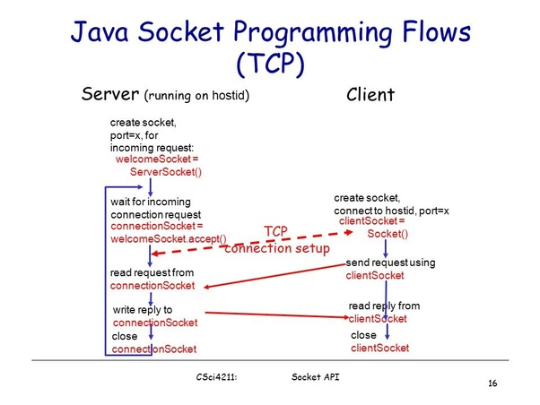

# About
- TCP is relatively simple and reliable protocol that enables a client to make a connection to a server and the two systems to communicate. In TCP, each entity knows that its communication payloads have been received.
- UDP is a connectionless protocol and is good for scenarios where you do not necessarily need every packet to arrive at its destination, such as media streaming.
- This project demostrates client-server examples using Java I/O framework.
- The following code opens a connection to a server:  

			Socket socket = new Socket( server, port ); 
	
- Used methods to obtain input and output streams:  

			InputStream in = socket.getInputStream();  
			OutputStream out = socket.getOutputStream();

# Steps
- Create a ServerSocket, specifying a port to listen on.
- Invoke the ServerSocket's accept() method to listen on the configured port for a client connection.
- When a client connects to the server, the accept() method returns a Socket through which the server can communicate with the client. This is the same Socket class that we used for our client, so the process is the same: obtain an InputStream to read from the client and an OutputStream write to the client.
- If you server needs to be scalable, you will want to pass the Socket to another thread to process so that your server can continue listening for additional connections.
- Call the ServerSocket's accept() method again to listen for another connection.
# How to Run
- Download the project
- First run the main method in ServerSocketExample.java
- Then, Run main method in ClientSocket.java

Will observe the output as in ServerSocket Terminal
-----------------------------------------------------
Start server on port: 80  
Listening for a connection

Will observe the output as in Client Terminal
-----------------------------------------------------
Loading contents of URL: 127.0.0.1  
Echo Server 1.0  
Echo: GET / HTTP/1.0

Once you will satrt client program,
Will observe the output as in ServerSocket Terminal
-----------------------------------------------------
Received a connection

